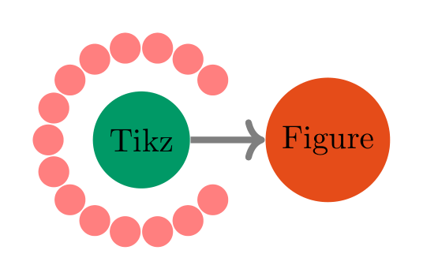

# tikzfigure

Python interface to generate (readable) Tikz figures.

# Install

Create and activate python environment, then install `tikzfigure` with

```
pip install tikzfigure
```

# Examples

## Generate tikz-figures with Python API

Generate a simple TikZ figure with nodes and arrows, see <a
href="#fig-tikzfigure" class="quarto-xref">Figure 1</a>.

```python
from tikzfigure import TikzFigure

fig = TikzFigure()

n1 = fig.node(x=0, y=0, shape="circle", fill="blue!40!green", content="Tikz")
n2 = fig.node(x=2, y=0, shape="circle", fill="purple!40!orange", content="Figure")

fig.draw([n1, n2], line_width=2, arrows="->", color="gray")

fig.variable("R", 1.0)

with fig.loop("angle", range(40, 340, 20)) as loop:
    loop.node(
        x=r"\R*cos(\angle)",
        y=r"\R*sin(\angle)",
        shape="circle",
        fill="red!50",
    )

fig.show()
```



For segment-local TikZ options, you can also build paths fluently with
`Node.to(...)` and keep path-wide styling on `fig.draw(...)`.

You can also save the figure as a `.tikz` file or print the LaTeX code:

```python
print(fig)
```

```
% --------------------------------------------- %
% Tikzfigure generated by tikzfigure v0.2.1     %
% https://github.com/max-models/tikzfigure      %
% --------------------------------------------- %
\begin{tikzpicture}
    \pgfmathsetmacro{\R}{1.0}
    \node[shape=circle, fill=blue!40!green] (node0) at ({0}, {0}) {Tikz};
    \node[shape=circle, fill=purple!40!orange] (node1) at ({2}, {0}) {Figure};
    \draw[color=gray, line width=2, arrows=->] (node0) to (node1);
    \foreach \angle in {40,60,80,100,120,140,160,180,200,220,240,260,280,300,320}{
        \node[shape=circle, fill=red!50] () at ({\R*cos(\angle)}, {\R*sin(\angle)}) {};
    }
\end{tikzpicture}
```

Note that to visualize the plots in a popup or in jupyterlab, install with
`pip install "tikzfigure[vis]"`

## IPython Magic Commands

tikzfigure includes IPython magic commands for compiling TikZ figures directly
in Jupyter notebooks!

Load the extension:

```python
%load_ext tikzfigure.ipython
```

Then use the `%%tikz` cell magic:

```tikz
%%tikz
\begin{tikzpicture}
\draw[thick, blue] (0,0) circle (2cm);
\node at (0,0) {Hello TikZ!};
\end{tikzpicture}
```

See [tutorials](https://max-models.github.io/tikzfigure/tutorials) for more
examples!
