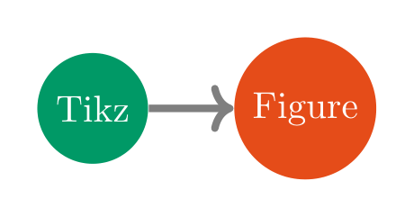

# tikzfigure

Python interface to generate (readable) Tikz figures.

# Install

Create and activate python environment, then install `tikzfigure` with

    pip install tikzfigure

# Examples

## Generate tikz-figures with Python API

Generate a simple TikZ figure with nodes and arrows, see
<a href="#fig-tikzfigure" class="quarto-xref">Figure 1</a>.

```python
from tikzfigure import TikzFigure

fig = TikzFigure()

n1 = fig.add_node(0, 0, shape="circle", fill="blue!40!green", content="Tikz")
n2 = fig.add_node(2, 0, shape="circle", fill="purple!40!orange", content="Figure")

fig.draw([n1, n2], line_width=2, arrows="->", color="gray")

n3 = fig.add_node(4, 0, shape="circle", fill="orange!50", content="Chain")
fig.draw(
    n1.to(n2).to(n3, options=["bend left"], looseness=1.2),
    color="blue",
)

fig.show()
```

For segment-local TikZ options, you can also build paths fluently with `Node.to(...)` and keep path-wide styling on `fig.draw(...)`.



You can also save the figure as a `.tikz` file or print the LaTeX code:

```python
print(fig)
```

    % --------------------------------------------- %
    % Tikzfigure generated by tikzfigure v0.2.1     %
    % https://github.com/max-models/tikzfigure      %
    % --------------------------------------------- %
    \begin{tikzpicture}
        \node[shape=circle, fill=blue!40!green] (node0) at ({0}, {0}) {Tikz};
        \node[shape=circle, fill=purple!40!orange] (node1) at ({2}, {0}) {Figure};
        \draw[color=gray, line width=2, arrows=->] (node0) to (node1);
        \node[shape=circle, fill=orange!50] (node2) at ({4}, {0}) {Chain};
        \draw[color=blue] (node0) to (node1) to[bend left, looseness=1.2] (node2);
    \end{tikzpicture}

Note that to visualize the plots in a popup or in jupyterlab, install
with `pip install "tikzfigure[vis]"`

## IPython Magic Commands

tikzfigure includes IPython magic commands for compiling TikZ figures
directly in Jupyter notebooks!

Load the extension:

```python
%load_ext tikzfigure.ipython
```

Then use the `%%tikz` cell magic:

```tikz
%%tikz
\begin{tikzpicture}
\draw[thick, blue] (0,0) circle (2cm);
\node at (0,0) {Hello TikZ!};
\end{tikzpicture}
```

See [tutorials](https://max-models.github.io/tikzfigure/tutorials) for
more examples!
